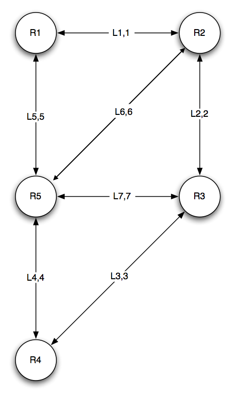

Open Shortest Path Routing
==========================

About
-----

This program contains a java implemententation for the Open Shortest Path First routing algorithm (OSPF). 
*For more information on link-state routing algorithms see https://searchnetworking.techtarget.com/definition/OSPF-Open-Shortest-Path-First*

To achieve this, our individual 5 router programs will conect to a provided Network State Emulator (NSE) program with the following hardcoded 5-router circuit database:

Compiling and Setup
-------------------

The emulator is an executable file which should be run before the individual router programs. When running the emulator, pass the host address on which the router programs are running as well as a port number to communicate on.

*E.g. ./nselinux386 <router_host_address> <emulator_port>* 

**Note: Unfortunately, the emulator was compiled in 32-bit architecture and therefore running on 64-bit architecture will require manually adding the i386 architecture. Details on the workaround can be found here: *https://superuser.com/questions/1076730/how-to-run-32-bit-app-in-recent-ubuntu-64-bit***

The router application can be compiled via the 'make' command. To start the application run the java program while passing the router id, emulator host address, emulator port number and router port.

*E.g. java Router <router_id> <emulator_host> <emulator_port> <router_port>*

**- Make sure to start the emulator before starting the router programs**

Example Execution
-----------------

1. ./nselinux386 127.94.48.56 9999
2. java Router 1 127.59.09.342 9999 9991
3. java Router 2 127.59.09.342 9999 9992
4. java Router 3 127.59.09.342 9999 9993
5. java Router 4 127.59.09.342 9999 9994
6. java Router 5 127.59.09.342 9999 9995

Program Flow
------------

1. When a router comes online it sends an INIT packet to the emulator and receives a packet containing all links/edges connected to that specific router

2. This information is logged in the routers topology database (the routers overall picture of the network)

3. Each router then sends a *HELLO* packet to its direct neighbors notifying them of its existence in the network.

4. In response to each *HELLO*, each router sends a set of *LS_PDU* packets indicating all its links with their associated costs.

5. Whenever a router receives a new *LS_PDU* it updates its topology database and runs Dijkstra's shortest path algorithm to find the shortest paths to each router which it keeps in its Routing Information Base (RIB), after which it propogates that *LS_PDU* through the network. 

6. This process continues until there are no transient packets in the network at which point each router will have a complete list of links in the network and an accurate Routing Information Base with the lowest costs.
